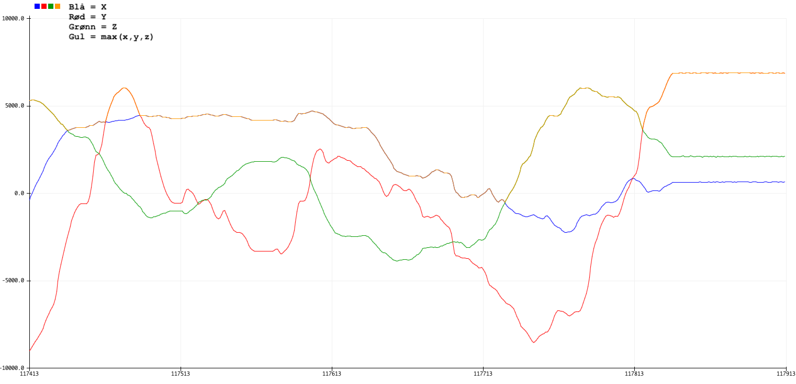

## Hypotese

* Det er mulig å detektere en magnetisk ball ved hjelp av digitalt/ elektrisk kompass
* Ved å basere seg på den sterkeste mangetiske kraften (x,y,z) vil man kunne måle avstanden til magneten (ballen)

## Utstyr

* MAG3110
* Teensy 3.1 (eller annen arduino-kompatibel mikrokontoller)
* Magnet (helst magnetisk ball)

## Eksperiment

* Alle aksene til MAG3110 (x,y,z) ble målt og rapportert til serieport.

## Resultat

**Ikke vellykket** 

Problem: Kompasset detekterer ballens rotasjon ***i tillegg til*** ballens magnetfelt.

Dersom man roterer på ballen mens man beholder balles posisjon (konstant avstand til sensor), varierer max(x,y,z).

## Interessante funn

Det finnes nok en god del bruksområder for denne teknikken.

Antakelser:
* Dersom f.eks ballen er stasjonær, kan man måle vinkelen på ballen i alle tre akser
* Dersom magnetens poler er konstant (f.eks dersom man monterer en magnet i en boks), vil man kunne lokalisere magnetens posisjon

